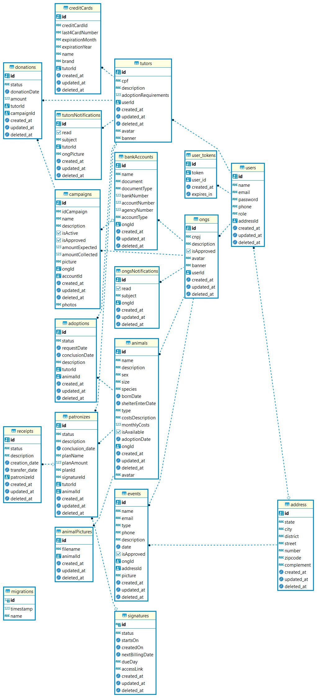

**TAREFAS**

- [ ] 1) Converter a App de monolitico para microserviço
  - [ ] 1.1) Docker 
  - [ ] 1.2) Gateway
  - [ ] 1.3) Broker (Kafka)

- [ ] 2) Kubernetes
- [ ] 3) Redis - in-memory data structure store
- [ ] 4) Incorporar Metodo de pagamento JUNO BY EBANX
- [ ] 5) Grafana
- [ ] 6) Prometheus
- [ ] 7) Consul
- [ ] 8) Terraform

# Banco de dados:
- [x] 01) address
- [x] 02) adoptions
- [x] 03) animalPictures
- [x] 04) animals
- [x] 05) bankAccounts
- [x] 06) campaings
- [x] 07) creditCards
- [x] 08) donations
- [x] 09) events
- [x] 10) ongs 
- [x] 11) ongsNotifications 
- [x] 12) patronizes 
- [x] 13) receipts
- [x] 14) signatures 
- [x] 15) tutors
- [x] 16) tutorsNotifications 
- [x] 17) user_tokens 
- [x] 18) users

**Explicações:**

Todas as rotas estão protegidas por autenticação, menos a rota de cadastro de usuarios
o cadastro de usuario pode ser do tipo: Admin, Editor, Tutor ou ONG.

Após o cadastro do usuario. Para acessar as rotas especificas deste usuario, faz-se necessario estar logado com JWT (access token concedido pela API)

Muitos casos o Id do turor, ONG ou User é obtido por meio do payload contido no token vindo do front-end. Isso ocorre usando o segunte codigo "@GetCurrentUserId()" no arquivo Controller. Ele é isolado e inserido na coluna (da tabela do banco de dados) correspondente.

Para melhor experiencia fazer o "import" do arquivo Insomnia_... (localizado na raiz do projeto) no "Insomnia" e testar as rotas, headers, enviar fotos...

Tutor pode:
  Ver, editar ou deletar ele mesmo.
  Ver as notificações respectivas a ele.
  ...

ONG pode:
  Ver, editar ou deletar a mesma.
  Ver as notificações respectivas a ela.
  Ver e criar as notificações delas enviadas para um tutor especifico.
  ...

**ROTAS**

 # Users:

## Sign Up:

- POST: http://localhost:8000/api/v1/local/signup
  - JSON:
  {
    "personal_data":
    {
      "name": "Vandreh",
      "email": "V@v.com",
      "cpf": "788888888",
      "phone": "123456789",
      "role": "admin"
    },
    "address":
    {
      "state": "ceara",
      "city": "fortaleza",
      "district": "aldeota",
      "street": "santos dumont",
      "number": "123",
      "zipcode": "60060600",
      "complement": "..."
    },
    "password": "123456789"
  }

  - Recebe:
    access_token: "string",
    refresh_token: "string"

###### Ao realizar Sign Up serao preenchidas 4 tabelas (Users, Address, user_tokens e (Tutors ou ONGS)) Por fazer, organizar modules/hash para somente inserir os dados nas tabelas quando estiver tudo ok (...repository.CREATE and ...repository.SAVE).

## Sign In:

- POST: http://localhost:8000/api/v1/local/signin
  - JSON:
    {
      "email": "v@v.com",
      "password": "123456789"
    }

    - Recebe:
     access_token: "string",
     refresh_token: "string"

## Logout:

- POST: http://localhost:8000/api/v1/logout
  - Bearer "access_token"

## Refresh Token:

- POST: http://localhost:8000/api/v1/refresh
  - Headers: Authorization: "Bearer 'access_token'"

## Profile
- GET: http://localhost:8000/api/v1/profile
  Bearer "token"

# Tutors:

## Criar tutores:

- POST: http://localhost:8000/api/v1/tutors - Headers: Authorization:  Bearer "access_token" -JSON:{"cpf": "Jon","description": "Jon","avatar": "Jon","banner": "Jon","adoptionRequirements": "0"	}

## Listar tutores:

- GET: http://localhost:8000/api/v1/tutors
  - Headers: Authorization:  Bearer "access_token"

## Mostrar avatar:

- GET http://localhost:8000/api/v1/tutors/avatar/:imagename
  - Headers: Authorization:  Bearer "access_token"

## UPLOAD IMAGES: Enviar imagens para atualizar tutores e ONG's (banner e avatar):

- POST: http://localhost:8000/api/v1/tutors/upload/avatar  //Para atualizar avatar
ou
- POST: http://localhost:8000/api/v1/tutors/upload/banner  //Para atualizar banner

- POST: http://localhost:8000/api/v1/ongs/upload/avatar  //Para atualizar avatar
ou
- POST: http://localhost:8000/api/v1/ongs/upload/banner  //Para atualizar banner

Multipart Form:
  file: "enviar arquivo"

Headers:
  Authorization:  Bearer "access_token"

# Notificações:

## Criar Notificação para tutores:
- POST: http://localhost:8000/api/v1/tutorsNotifications
  - JSON:
  {
    "read": false,
    "subject": "ONG aceitou seu pedido de adoção",
    "ongPicture": "1669733417538-xhorse.jpg",
    "tutorId": "e3470b50-a5e3-44b9-a422-a5d1d1fbf181"
  }

## Selecionar todas as notificações>

- GET: http://localhost:8000/api/v1/tutorsNotifications

## Selecionar notificação por ID:

- GET: http://localhost:8000/api/v1/tutorsNotifications/:id (tutorsNotifications)

# Animals e AnimalPictures

## Selecionar Todos:
- GET: http://localhost:8000/api/v1/animals
  - Headers: Authorization:  Bearer "access_token"

## Selecionar um animal por ID:
- GET: http://localhost:8000/api/v1/animals/:id
  - Headers: Authorization:  Bearer "access_token"

## Criar animal sem foto:
- POST: http://localhost:8000/api/v1/animals
  - Headers: Authorization:  Bearer "access_token"
  - JSON: {
    "name": "Jona1",
    "castrated": false,
    "hasVermifugation": false,
    "vaccinated": true,
    "hasInjuries": false,
    "state": "Ceará",
    "city": "Fortaleza",
    "observation": "",
    "sexo": "Fêmea",
    "species": "coelho",
    "bornDate": "2022-12-05",
    "raca": "coelhoide albinus"
  }

## Criar animal com até 5 fotos:
- POST: http://localhost:8000/api/v1/animals
  - Headers: Authorization:  Bearer "access_token"
  - Multipart Form:
    - file: "enviar arquivo"
    - file: "enviar arquivo"
    - file: "enviar arquivo"
    - values {
    "name": "Jona1",
    "castrated": false,
    "hasVermifugation": false,
    "vaccinated": true,
    "hasInjuries": false,
    "state": "Ceará",
    "city": "Fortaleza",
    "observation": "",
    "sexo": "Fêmea",
    "species": "coelho",
    "bornDate": "2022-12-05",
    "raca": "coelhoide albinus"
  }

# Adoptions

## Criar adoption: (Somente Tutor)
- POST: http://localhost:8000/api/v1/adoptions
  - JSON:
  {
    "status": "Em analise",
    "description": "Tutor solicitou outro pedido de adoção",
    "animalId": "d1f2d141-4baf-406f-a0b3-ed8a13f6a824"
  }
  - Headers: Authorization:  Bearer "access_token"
  - Recebe: adoption criada

## Atualizar adoption: (Tutor e ONG)
- POST: http://localhost:8000/api/v1/adoptions/:adoptionId
  - JSON:
  {
    "status": "Aprovado"
  }
  - Headers: Authorization:  Bearer "access_token"
  - Recebe: adoption alterada

## Deletar adoption: (Tutor e ONG)
- POST: http://localhost:8000/api/v1/adoptions/:adoptionId
  - Headers: Authorization:  Bearer "access_token"
  - Recebe: adoption deletada

# Events
  ## Upload de pictures:
  - POST: http://localhost:8000/api/v1/upload/picture
  - Headers: Authorization:  Bearer "access_token"

  Multipart Form:
  file: "enviar arquivo"

# Database

